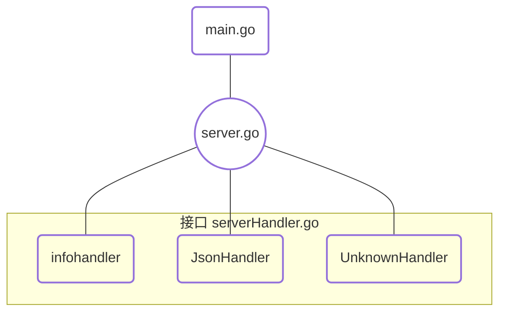

#  处理web程序的输入与输出

## 实验内容

​		设计一个 web 小应用，展示静态文件服务、js 请求支持、模板输出、表单处理、Filter 中间件设计等方面的能力。（不需要数据库支持）

## 实验要求

​		编程 web 应用程序 cloudgo-io：

* 支持静态文件服务
* 支持简单 js 访问
* 提交表单，并输出一个表格
* 对 /unknown 给出开发中的提示，返回码 5xx

## 实验过程

​		在本次实验中，老师已经给出了各项核心服务的Handler，在此我们需要将它们进行归整，整合到一个对于输入的响应函数中，以匹配不同操作类型并返回web内容。

​		首先我们要确认各个Handler对应的具体事件：

* InfoHandler：
  * 用于对服务端解析表单后对于表格的返回，其借助于html类型的格式化控制，其HandlerFunc接受以 /table为后缀扩展的地址字符串。由于实现了ServerHTTP接口，可以进行Handler类型的转化，进行路由匹配的处理。
* JsonHandler：
  * 用于支持简单js访问，接受以 /js为后缀扩展的地址字符串。同上实现了ServerHTTP接口以进行相关路由活动。
* UnknownHandler：
  * 用于对于非预期静态文件目录的访问进行报错回应，接受以 /unknown为后缀扩展的地址字符串，依然实现接口化支持路由。

​		以上便是为本次实验所需的功能组件，接下来的活动便是将它们整合起来封装为一个cloudgo-io web输入输出服务，因此实验的组织结构如下：



​		server.go作为接口的封装，整合了不同功能，来对于具体操作做出相应响应。首先是提供服务的创建组件：

```go
// 服务配置和生成
func NewServer() *negroni.Negroni {
	//支持本服务中html和json响应
	formatter := render.New(render.Options{
		//描述选项类型，在此支持html文件扩展
		Directory:  "templates",
		Extensions: []string{".html"},
		IndentJSON: true,
	})
	//构建negroni中间件库，其支持http.Handle
	n := negroni.Classic()
	//初始化用于执行http请求的后续路由列表
	//使用mx简化http的工作
	mx := mux.NewRouter()

	initRoutes(mx, formatter)
	//http.Handler和negroni.Handler间转换
	n.UseHandler(mx)
	return n
}
```

​		其使用render来对实验涉及的数据格式进行处理，并构建negroni中间库件（支持http.Handle的操作)，使用mux创建路由列表并使用之前定义的render接受与路径请求相对应的数据格式并进行格式匹配/绑定，然后调用UseHandler函数，对于匹配过的不同类型文件，执行之前在serverHandler中提供的不同handler。

```go
func initRoutes(mx *mux.Router, formatter *render.Render) {
	//获取环境变量中WEBROOT解析字符串
	webRoot := os.Getenv("WEBROOT")
	if webRoot == "" {
		//解析环境变量失败
		//若成功得到当前文件路径则设置为webROot，否则提示错误
		if root, err := os.Getwd(); err != nil {
			panic("Could not retrive working directory")
		} else {
			webRoot = root
		}
	}
	//**************************************************************************
	//访问静态文件系统绑定的本地端口，使用不同后缀名进入相应目录
	//相应目录中注册了处理器函数_XXHandler，对相应请求做出回应
	//定位URL到 webRoot + "/assets/" 为虚拟根目录的文件系统。
	mx.HandleFunc("/unknown", UnknownHandler(formatter))
	mx.HandleFunc("/table", InfoHandler(formatter))
	mx.HandleFunc("/js", JsonHandler(formatter)).Methods("GET")
	//http.Dir为强制类型转化而非函数，将字符串格式对应于文件系统
	//PathPrefix添加前缀路径接受文件服务的Handler，处理http请求进行路由
	mx.PathPrefix("/").Handler(http.FileServer(http.Dir(webRoot + "/assets/")))
	//**************************************************************************
}

```

​		initRoutes函数用于接受不同格式的文件数据，与用户键入的静态文件地址目录进行绑定/匹配，函数由两个主要部分组成，第一部分进行相关环境变量的获取，以解析路径；第二部分则是主要功能体现，即绑定部分。需要注意的是，http.Dir为强制类型转化而非函数，将字符串格式对应于文件系统，而PathPrefix添加前缀路径接受文件服务的Handler，处理http请求进行路由。在定位URL时，便用到了前半部分功能得到的webRoot，将其定位于webRoot + "/assets/" 为虚拟根目录的文件系统，其中/assets/存有需要显示的html文件和js文件，而表格显示存于/templates/中。

​		而main主要使用了之前作业所用的spf13包设置命令行指令 -p 来输入本地服务监听端口。

## 实验结果

​		在运行程序后，在网页键入本地地址和监听端口，进入静态文件列表：


​		点击html后进入表单填写目录：


​		填写/assets/中表单信息并提交，在服务端处理后，返回/templates/中表格内容：


​		当输入错误文件目录时返回以下Not Found提示：


​		在进行上述操作时，在终端得到Log如下：


​		首先执行可执行文件后返回监听端口，首先进入文件系统后发出请求Get .html文件，在进入/html后由于联系着js文件，则继续请求Get .js文件。填写表单后发出POST请求进行提交，服务端处理后返回表单结果，其过程在浏览器得到了.js文件对 .html进行处理。

## 实验总结

​		在这次实验中实现了一个简单的web服务来处理来响应输入进行输出，由于老师在博客中给出了handler的实现方法，因此任务便主要是对handler的应用与整合。当划分清楚实验的功能模块后可以发现本次实验内容较之前实验是相对容易的。随着学习过程的推进，我们接触到了越来越多的库，它们对于我们的实际应用操作起到了很大的简化作用，但是随着所学内容越来越多，当我们掌握不扎实时应用起来便会越来越不知所措，这也是我在完成这次作业时的一个感受，自己需要在阅读老师博客的时候频繁查找各个函数的解析。看来自己还是得分阶段做好总结，才不会顾此失彼。